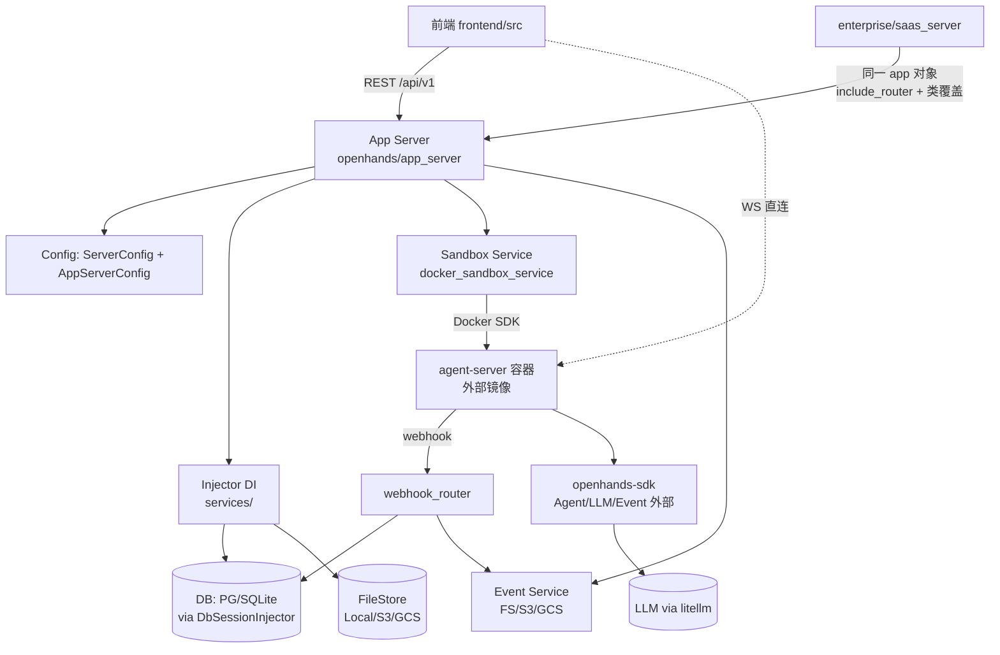
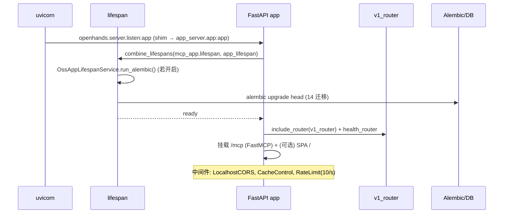

# 源码架构（SOURCE_ARCHITECTURE）

## 分析快照

- 分支：`main`
- HEAD：`2b31eb84eef6de2048c41d28033c9c3dc7444048`
- 工作区状态：clean
- 子模块状态：无（但存在通过命名空间包合并的外部 PyPI 包，见下）
- 分析范围：`openhands/`（含 `app_server/`、`server/`、`db/`、`analytics/`）、`frontend/src/`、`openhands-ui/`、`enterprise/`、`containers/`、`config.template.toml`、`pyproject.toml`
- 未覆盖范围：外部包内部源码（`openhands-sdk`/`openhands-agent-server`/`openhands-tools`）；构建产物与依赖缓存

> 本文档反映分析时工作区内容；工作区为 clean，等同 HEAD commit 状态。

## 证据分类

- Evidence：源码/配置直接证明
- Inference：多处证据推导
- Unknown：仓库内无法确认（多为外部依赖）

## 核心结论

> [Evidence] 本仓库是 **OpenHands 平台的"编排与 UI 层"**。Agent 推理循环、工具实现、LLM 客户端均在**外部** PyPI 包中，通过命名空间包合并进 `openhands.*`。
> 关键证据：`openhands/__init__.py:1-9`；`pyproject.toml:251-253`；`live_status_app_conversation_service.py:539`（POST 到外部 agent-server）。

---

## 1. 仓库总体结构

```
OpenHands/
├── openhands/            # 命名空间包（与外部 SDK 包合并）；V1 App Server 在 app_server/
├── frontend/             # React 19 SPA（react-router 7, Vite 7）
├── openhands-ui/         # 独立共享 UI 库（@openhands/ui，未接入主前端）
├── enterprise/           # SaaS/企业层（Polyform，叠加在 OSS app 之上）
├── containers/           # app/dev Dockerfile + compose
├── kind/                 # 本地 kind+mirrord K8s（仅开发）
├── tests/                # 顶层 OSS pytest（仅 unit/）
├── skills/               # 公共技能 markdown（随镜像打包）
├── .github/              # CI（26 workflows）
├── .openhands/ .agents/  # 仓库级技能/操作手册
├── dev_config/           # ruff/mypy/pre-commit 配置
├── config.template.toml  # 遗留 V0 配置模板（V1 不读取）
├── pyproject.toml        # Poetry + PEP621 双声明
├── Makefile              # build/run/lint/test 入口
└── docker-compose.yml    # 单服务自托管
```

跟踪文件分布（`git ls-files`）：frontend 1375、enterprise 585、openhands 277、tests 115、openhands-ui 81、.github 36。

## 2. monorepo / 多包结构

- 单 git 仓库，含 3 个独立的包管理单元：
  1. 根 `openhands-ai`（Poetry，Python）；
  2. `frontend/openhands-frontend`（npm，TS）；
  3. `openhands-ui/@openhands/ui`（Bun，TS）；
  4. `enterprise/`（Poetry，path 依赖 `openhands-ai`）。

## 3. 顶层目录职责（详见各节）

| 目录 | 职责 | Evidence |
| -- | -- | -- |
| `openhands/app_server/` | **V1 后端核心**：FastAPI app、路由、服务、沙箱编排、配置 | `app.py:54` |
| `openhands/server/` | **已废弃 shim**：全部 re-export 自 `app_server`（仅因 uvicorn 入口保留） | `server/listen.py:1-8` |
| `openhands/db/` | 仅 SSL 辅助（`ssl.py`），无 ORM 模型 | `db/__init__.py`、`db/ssl.py` |
| `openhands/analytics/` | PostHog 分析（带 consent gate） | `analytics/analytics_service.py` |
| `frontend/src/` | React SPA | `entry.client.tsx`、`routes.ts` |
| `openhands-ui/` | 独立组件库 | `index.ts:1-19` |
| `enterprise/` | SaaS 层（叠加在 OSS app 之上） | `saas_server.py:76,242` |

## 4. `openhands/app_server/` 子目录职责

| 子目录 | 职责 | 关键文件 |
| -- | -- | -- |
| `app_conversation/` | V1 会话编排（核心）；状态机驱动 sandbox→workspace→skills→agent-server | `app_conversation_router.py:107`、`live_status_app_conversation_service.py:264` |
| `app_lifespan/` | FastAPI lifespan + Alembic（14 迁移） | `oss_app_lifespan_service.py:12` |
| `config_api/` | `/api/v1/config`：LLM 模型/provider 搜索；`AppMode` 枚举 | `config_models.py:8-11` |
| `event/` | 事件存储（FS / S3 / GCS） | `event_router.py:18` |
| `event_callback/` | 入站 webhook（agent-server → app-server）；`/api/v1/webhooks/*` | `webhook_router.py:77,348,468` |
| `file_store/` | FileStore ABC + Local/Memory/S3/GCS | `file_store/` |
| `git/` | `/api/v1/git`：安装/分支/仓库/建议任务 | `git_router.py:41` |
| `integrations/` | GitHub/GitLab/Bitbucket/BBDC/AzureDevOps/Forgejo/JiraDC 服务客户端 | `integrations/service_types.py` |
| `mcp/` | FastMCP 服务（`/mcp`）：create_pr/mr 工具 + Tavily 代理 | `mcp_router.py:19,33` |
| `pending_messages/` | 离线消息队列（WS 断开时兜底） | `pending_message_router.py:24` |
| `sandbox/` | sandbox 生命周期（Docker/Process/Remote） | `docker_sandbox_service.py:86`、`sandbox_spec_service.py:17` |
| `secrets/` | `/api/v1/secrets`：provider token + 自定义 secret | `secrets_router.py:35` |
| `server_config/` | `ServerConfig` 类选择配置 + `load_server_config()` | `server_config.py:9-56` |
| `services/` | 横切 injector：`Injector[T]` ABC、DbSession、Jwt、httpx | `services/injector.py:12`、`db_session_injector.py:29`、`jwt_service.py:30` |
| `settings/` | `/api/v1/settings`：用户设置/agent profile/marketplace | `settings_router.py:95`、`settings_models.py` |
| `status/` | `/alive /health /ready /server_info`（无认证） | `status_router.py:5` |
| `user/` | `/api/v1/users/me`、`/api/v1/skills`、`UserContext` ABC | `user_router.py:15`、`auth_user_context.py:28` |
| `user_auth/` | `UserAuth` ABC + `DefaultUserAuth`（OSS 无认证） | `user_auth.py:35`、`default_user_auth.py:24` |
| `web_client/` | `/api/v1/web-client/config`：前端 bootstrap | `web_client_router.py:6` |
| `utils/` | logger、`sql_utils.Base`、`encryption_key`、`import_utils.get_impl`、`dependencies` | `utils/sql_utils.py:10`、`utils/import_utils.py:43`、`utils/dependencies.py:13` |
| `recaptcha/` | reCAPTCHA 日志路由（**未挂载**到 v1_router；仅 SaaS） | `recaptcha_router.py:12` |

## 5. 分层方式与模块依赖方向

```
前端 (frontend/src)
   │  REST (/api/v1/*) + 原生 WS (直连 agent-server) + Socket.IO (后台)
   ▼
V1 App Server (openhands/app_server)  ── FastAPI
   │  路由 → 服务 → injector(DI) → ORM/存储
   │  配置：ServerConfig(类选择) + AppServerConfig(Pydantic, env)
   │  启动沙箱 ──► Docker SDK
   ▼
每会话 agent-server 容器 (外部镜像 ghcr.io/openhands/agent-server:<v>-python)
   │  内含 openhands-agent-server + openhands-sdk + openhands-tools
   │  运行 Agent 循环
   ▼
LLM (litellm) / 文件系统 / git provider / MCP
```

> [Evidence] 依赖方向：前端→app-server→(启动)agent-server；agent-server→(webhook 回调)app-server、(WS)前端。app-server 不反向调用前端的 WS。

### 主要模块依赖图（Mermaid）



## 6. 应用入口与启动时序

### 启动时序图（Mermaid）



> [Evidence] `app.py:30-86`；`oss_app_lifespan_service.py:23-38`；入口 `containers/app/Dockerfile:105` 与 `Makefile:262`。

## 7. 配置系统

> [Evidence] 三套配置并存（已在 TECH_STACK 详述）：
> 1. `ServerConfig`（`server_config.py:9-56`，类选择：`settings_store_class`/`secret_store_class`/`user_auth_class`/...，env `OPENHANDS_CONFIG_CLS` + `get_impl` 动态导入）；
> 2. `AppServerConfig`（`config.py:191-237`，Pydantic，`config_from_env()` 用外部 `from_env(...,'OH')`，单例 `get_global_config()`）；
> 3. 散落 `os.getenv`（各 feature 模块，向后兼容）。
> `config.template.toml` 是遗留 V0 模板，V1 不读取。

## 8. 错误模型

- `OpenHandsError` 基类 + `AuthError`/`PermissionsError`/`SandboxError`/`SandboxDeleteRetryError`（`app_server/errors.py`）。
- `AuthenticationError`（integrations）→ 401 JSON（`app.py:63-68`）。
- SaaS：`NoCredentialsError`/`ExpiredError` → 401（`saas_server.py:227-238`）。

## 9. 日志与监控

- OSS：`app_server/utils/logger.py`；analytics：PostHog（consent gate）。
- SaaS：JSON logger（`enterprise/server/logger.py`，`python-json-logger`）；Datadog/ddtrace；PostHog session middleware。

## 10. 安全边界

| 边界 | 机制 | Evidence |
| -- | -- | -- |
| OSS 认证 | `DefaultUserAuth`（无）；可选 `SESSION_API_KEY` 共享密钥（`utils/dependencies.py:9`） | `default_user_auth.py:24` |
| SaaS 认证 | Keycloak + chunked cookie（JWS）+ TOS | `enterprise/server/middleware.py:135-160` |
| 每 sandbox | `session_api_key`（仅 RUNNING 有效，SHA-256 校验） | `sandbox/session_auth.py:37-100` |
| 列加密 | `StoredSecretStr`（JWE）；SaaS Fernet/JWT（`enterprise/storage/encrypt_utils.py`） | `utils/sql_utils.py:44-70`、`jwt_service.py:30` |
| JWT 算法 | 锁定 `['dir','A256GCM']`，防 alg 混淆 | `jwt_service.py:27` |
| RBAC（SaaS） | `Permission` enum + `require_permission`；角色 owner/admin/member | `enterprise/server/auth/authorization.py:48` |
| webhook | HMAC 签名（如 `GITHUB_APP_WEBHOOK_SECRET`） | `enterprise/server/routes/integration/github.py:33-49` |

## 11. 进程 / 线程 / 异步模型

- 单 uvicorn 进程，async（FastAPI + asyncpg + aiohttp）。
- 每 sandbox = 独立 Docker 容器（外部进程），通过 HTTP+WS 通信。
- 后台任务：`asyncio.create_task`（如 `_consume_remaining` 会话状态推进）；SaaS 维护任务队列（`maintenance_task` 表 + CronJob 脚本 `run_maintenance_tasks.py`）。
- DB 会话跨请求生命周期：`set_db_session_keep_open`（会话启动/沙箱删除场景）。

## 12. 平台抽象

- sandbox 三后端（`config.py:332-394`）：Docker / Process / Remote。
- 文件存储四后端：Local / Memory / S3 / GCS。
- DB 多后端：asyncpg / pg8000 / SQLite / GCP Cloud SQL。
- LLM：litellm（多 provider）。

## 13. 扩展机制（详见 `扩展机制.md`）

- 类覆盖：`OPENHANDS_CONFIG_CLS` + `get_impl`（UserAuth/SettingsStore/SecretsStore/AppLifespanService/ConversationSecretEnricher/AnalyticsUserProvider）。
- 路由叠加：`base_app.include_router`（enterprise）。
- 路由覆盖：`override_users_me_endpoint`（monkey-patch）。
- MCP 工具：FastMCP 注册 `create_pr` 等。
- 技能：markdown 文件，运行时加载。

## 14. 测试结构（详见 `测试与CI.md`）

- OSS：`tests/unit/`（109 test 文件）；enterprise：`enterprise/tests/unit/`（156）；前端 vitest（283）+ playwright（2，chromium）。
- 无本仓库 runtime/agent 测试（外部 SDK）。

## 15. 部署结构

- OSS：`docker-compose.yml`（单服务，端口 3000，挂 docker.sock）。
- SaaS：`enterprise/Dockerfile`（叠在 OSS 镜像之上）。
- 生产 K8s：外部 `OpenHands/deploy` Helm；本地 `kind/`。

## 16. 生成代码 / vendored source

- 无 vendored 第三方源码。
- 生成代码：`frontend/src/i18n/declaration.ts`（`make-i18n` 脚本生成）；`frontend/public/locales/*`（生成，gitignored）。
- 外部 PyPI 包（`openhands-*`）通过命名空间合并，非 vendored。

## 17. 技术债务

- `openhands/server/*` 全为 shim，仅为 uvicorn 入口保留。
- 三套配置系统；双重锁文件；双重依赖声明。
- README 与实际产品/端口不符。
- `python-socketio`/`flake8`/`black`/`autopep8` 僵尸配置。
- mypy SDK 版本漂移（OSS 1.36.0 vs enterprise 1.33.0）。
- `enterprise/Makefile` 引用不存在的 `app/` 目录；`enterprise/enterprise_local/` 不存在。
- 三套 Design Token 互不统一；`openhands-ui` 未接入前端。

## 18. 架构风险

| 风险 | 影响 | 证据 |
| -- | -- | -- |
| 核心运行时强耦合外部仓库版本 | 版本不一致可能崩溃 | `sandbox_spec_service.py` 版本守卫 |
| enterprise 用字符串嗅探 `'saas' in OPENHANDS_CONFIG_CLS` 选 lifespan | 脆弱 | `config.py:174-183` |
| DB session 跨请求 keep_open | 连接泄漏/事务边界模糊 | `app_conversation_router.py:376,999` |
| OSS 无认证即 root | 暴露 3000 端口即全权 | `default_user_auth.py:24` |
| 前端直连 agent-server WS | app-server 对实时事件无完整可见性 | `websocket-url.ts:78` |

## 19. 文档与源码冲突

- README 端口 8000 ≠ 实际 3000。
- README `@openhands/agent-canvas`/`ghcr.io/openhands/agent-canvas` ≠ 本仓库 `openhands-frontend`/`openhands:latest`。
- README 称"集成 Notion"——本仓库无源码。
- `frontend/README.md` 仍提 Redux 与不存在的 `state/` 目录（前端实际用 Zustand）。
- `config.template.toml` 含 `[llm]` 外的丰富配置，但 V1 不读取该文件。

---

## 架构边界审计

| 检查项 | 结论 | 证据 |
| -- | -- | -- |
| 循环依赖 | 未发现明显循环；app-server↔agent-server 为双向 HTTP/WS 但职责分明 | — |
| 跨层调用 | 前端绕过 app-server 直连 agent-server（设计如此，但弱化了 app-server 中间层） | `websocket-url.ts:78` |
| 全局状态 | `get_global_config()` 模块级单例；OSS analytics 模块级单例 | `config.py:423-433` |
| 隐式依赖 | 命名空间包合并外部包，静态分析易漏路径 | `__init__.py:1-9` |
| 模块职责重叠 | `openhands/server/*` 与 `app_server/*` 重叠（shim） | `server/*.py` |
| 数据访问泄漏 | ORM 模型分散在各 service 旁（非集中 repository） | 各 `sql_*_service.py` |
| UI 与业务耦合 | 前端有 17 Zustand store + 服务层纯函数 reducer，耦合可控 | `stores/`、`services/` |
| 平台代码泄漏 | 无明显平台特定代码泄漏到通用层 | — |
| 错误边界 | `OpenHandsError` 层次清晰；SaaS 异常→401 | `errors.py` |
| 生命周期边界 | DB session keep_open 跨请求为已知边界风险 | `app_conversation_router.py:376` |

---

## 已确认事实

- 单仓库多包；V1 后端在 `app_server/`；`server/` 全为 shim。
- 三套配置；外部 SDK 通过命名空间合并。
- enterprise 为"叠加 + 类覆盖"的 superset 部署。

## 合理推断

- 仓库处于 V0→V1 + 外部抽取的迁移中期，遗留物较多。

## Unknown 与待验证事项

- 外部 SDK 内部架构（无法在本仓库验证）。
- SaaS 生产路由实际启用集合（条件挂载）。

## 批判性评估

- 架构清晰度被三套配置、shim、过期 README 削弱。
- DI（Injector）与类覆盖是合理的扩展模型，但字符串嗅探 lifespan 是瑕疵。

## 建设性改善建议

- [Recommendation] 删除 `server/*` shim，uvicorn 目标改 `app_server.app:app`。优先级：中。
- [Recommendation] 用显式字段替代 `'saas' in ...` 字符串嗅探。优先级：中。
- [Recommendation] 集中 ORM 模型或加 repository 层，降低数据访问散落。优先级：低。
- [Recommendation] 收敛配置系统。优先级：中。

## 主要证据索引

- `openhands/__init__.py:1-9`
- `openhands/app_server/app.py:30-86`
- `openhands/app_server/v1_router.py:24-37`
- `openhands/app_server/config.py:174-183,191-237,332-394,423-433`
- `openhands/app_server/server_config/server_config.py:9-56`
- `openhands/app_server/services/injector.py:12`、`db_session_injector.py:29`、`jwt_service.py:27,30`
- `openhands/app_server/utils/sql_utils.py:10-70`、`import_utils.py:43`、`dependencies.py:13`
- `openhands/app_server/sandbox/docker_sandbox_service.py:86`、`sandbox_spec_service.py:17,119-138`、`session_auth.py:37-100`
- `enterprise/saas_server.py:76-242`、`server/config.py:56`、`server/auth/authorization.py:48`
- `containers/app/Dockerfile:89,105`、`Makefile:260-308`
