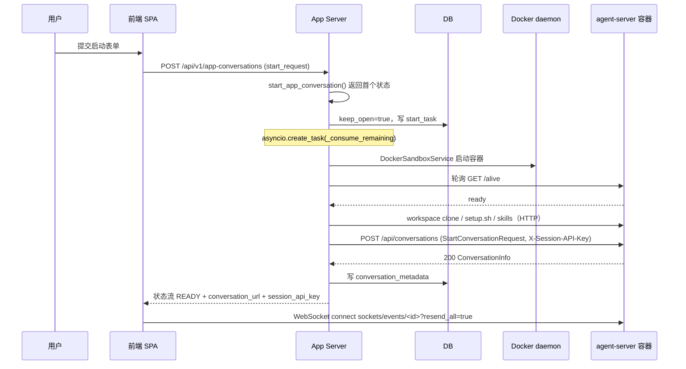
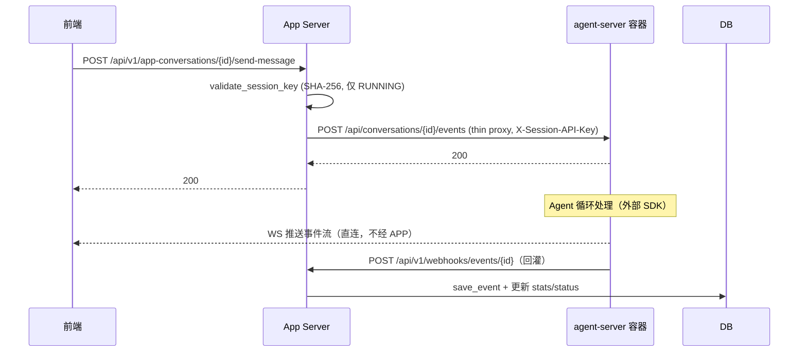
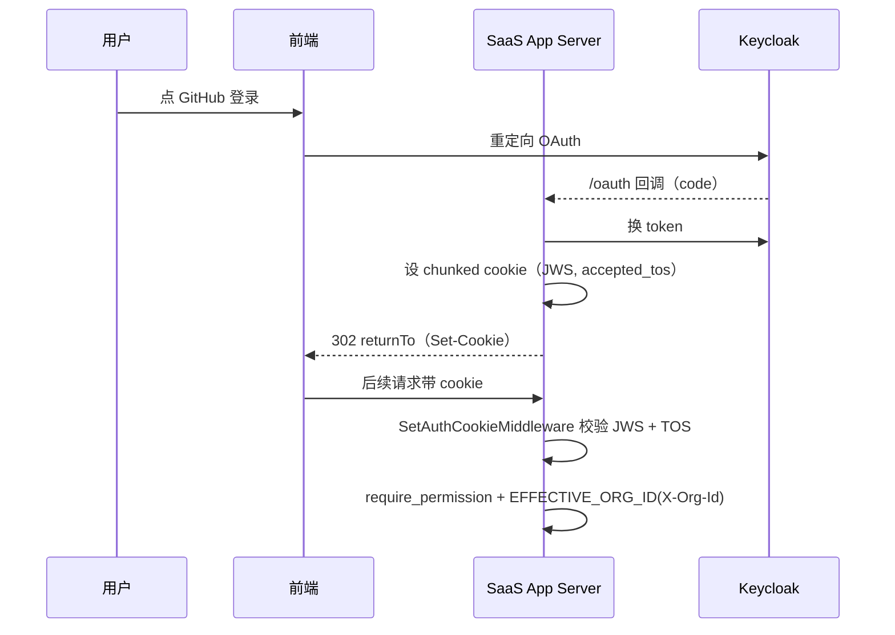

# 核心数据流（核心数据流.md）

## 分析快照

- 分支：`main`；HEAD：`2b31eb84eef6de2048c41d28033d9c3dc7444048`
- 工作区状态：clean；子模块：无
- 分析范围：会话启动/发消息/事件流/webhook 回灌/设置/git 集成/SaaS 登录
- 未覆盖范围：外部 agent-server 内部数据处理（无法验证）

## 证据分类

- Evidence / Inference / Unknown

## 核心结论

> [Evidence] 本仓库最关键的数据流均跨越 **浏览器 → App Server → agent-server 容器** 三边界，且实时事件经**两条独立通道**（前端 WS 直连 + 后端 webhook 回灌）传播，需注意"多个真相来源"风险。

---

## 流 1：启动会话（Start Conversation）

- 触发点：用户在 `/` 或 `/launch` 提交 prompt/repo/文件。
- 输入：`StartAppConversationRequest`（含 LLM 配置、repo、initial message、skills、files）。



- 关键类型/函数：`start_app_conversation`（`app_conversation_router.py:364`）、`LiveStatusAppConversationService.start_app_conversation`（`live_status...:264`）、`DockerSandboxService`（`docker_sandbox_service.py:86`）、`StartConversationRequest`（外部 `openhands.agent_server.models`）、`StoredConversationMetadata`（`sql_app_conversation_info_service.py:91`）。
- 事务边界：`set_db_session_keep_open`（`app_conversation_router.py:376`），跨多次状态更新，最终由 `_consume_remaining` 收尾提交。
- 错误路径：沙箱 `/alive` 超时→`SandboxError`；agent-server 启动失败→状态 ERROR。
- 重试：[Unknown] 是否对 `POST /api/conversations` 重试（未见显式重试）。
- 并发边界：每会话独立沙箱容器，互不干扰。

## 流 2：发送消息（Send Message）

- 触发点：用户在聊天框输入并发送。
- 输入：`SendMessageRequest`（文本/图片/动作）。



- 关键函数：`send_message`（`app_conversation_router.py:441`，docstring `:467` 明确 thin proxy）、`validate_session_key`（`session_auth.py:37`）、`on_event`（`webhook_router.py:468`）。
- 事务边界：webhook 回灌各自独立事务（每次 `save_event`）。
- 幂等性：[Inference] 事件按 id 去重（`useEventStore` 前端去重 + 后端 save_event），但 `send_message` 本身非幂等（重复发送会重复触发 Agent）。
- 风险：thin proxy 不做业务校验，所有逻辑在 agent-server（外部）。

## 流 3：实时事件分发（前端 reducer）

- 触发点：agent-server 经 WS 推送事件。
- 输入：JSON 事件（v1 类型守卫）。
- 处理（`conversation-websocket-context.tsx:80-1002`）：解析 → 按 event kind 分发 → `useEventStore`（追加+去重+delta 合并）/`useMetricsStore`/`useCommandStore`/`useBrowserStore` → 失效 TanStack cache（`handleActionEventCacheInvalidation`）→ 错误 toast。
- 状态变化：多个 Zustand store + TanStack cache。
- 风险：**多个真相来源**——前端 store 与后端 DB 各持事件视图；title 变更经 `actions.ts` 失效 `["user","conversation",id]`。
- [Unknown] 前端 store 与后端持久化事件在极端情况（WS 丢包+webhook 延迟）的一致性策略细节。

## 流 4：webhook 回灌（agent-server → App Server）

- 触发点：agent-server 产生事件/状态变更。
- 入口：`POST /api/v1/webhooks/events/{conversation_id}`（`webhook_router.py:468`）、`POST /api/v1/webhooks/conversations`（`:348`，生命周期）、`/api/v1/webhooks/secrets`（token 取回）。
- 处理：`EventService.save_event` → 统计更新 → 执行状态持久化 → 后台 `asyncio.create_task` 跑 event-callback processor（如 `SetTitleCallbackProcessor`，`:583-627`）。
- 持久化：DB（事件元数据 + 统计）+ FileStore/S3/GCS（原始事件体）。
- 事务边界：每次回灌独立事务。
- 鉴权：`X-Session-API-Key`（`session_auth.py`）。

## 流 5：用户设置读写（LLM 配置）

- 触发点：用户在 `/settings/llm-settings` 保存。
- 输入：`Settings`（Pydantic，含 `llm_api_key` 等）。

```mermaid
sequenceDiagram
  participant FE as 前端
  participant APP as App Server
  participant ST as SettingsStore
  participant SE as SecretsStore
  FE->>APP: PUT /api/v1/settings (Settings)
  APP->>ST: save_settings（OSS: 文件; SaaS: DB 加密列）
  APP->>SE: save provider tokens / secrets
  APP-->>FE: 200
  Note over FE: 失效 ["settings"] query
```

- 关键：`settings_router.py:95`、`Settings`（`settings_models.py:658-1073`）、`FileSettingsStore`/`SaasSettingsStore`、`StoredSecretStr`（JWE 加密，`sql_utils.py:44-70`）。
- 事务边界：OSS 无事务（文件）；SaaS DB 事务 + 列加密。
- 风险：API key 经 JWE 加密落库；前端不持久化（仅 cookie 会话）。

## 流 6：git 集成 / 建议任务

- 触发点：用户连接 GitHub/GitLab 或刷新任务。
- 入口：`/api/v1/git/installations|repos|branches|suggested-tasks`（`git_router.py:41`）。
- 处理：`app_server/integrations/{github,...}/service/*` 调外部 provider API。
- 状态变化：provider token 存 `SecretsStore`；建议任务实时拉取（不持久化或缓存于前端）。
- 风险：[Inference] 无显式服务端缓存，每次请求打 provider API。

## 流 7：SaaS 登录与组织上下文



- 关键：`enterprise/server/routes/auth.py:80`、`middleware.py:135-160`、`cookie_chunking.py`、`authorization.py:48`、`org_context.py`。
- 事务边界：token 持久化（`OfflineTokenStore`，PG）独立事务。
- 风险：cookie chunking（token >4096B）；JWS 由应用签名（非 Keycloak）。

## 流 8：SaaS webhook 集成（GitHub → 会话）

- 触发点：外部 GitHub push/issue 事件。
- 入口：`POST /integration/github/events`（`enterprise/server/routes/integration/github.py:26`），HMAC 校验（`:33-49`）。
- 处理：`resolver_org_router.resolve_org_for_repo`（`integrations/resolver_org_router.py:16`）→ 定位 org → 触发 automation/会话。
- 状态变化：`github_app_installation`/`user_repo_map`/`openhands_pr` 等表。
- 事务边界：单 webhook 独立事务。
- 幂等性：[Inference] 依赖 event id 去重，但未见集中幂等键。

---

## 数据流风险检查

| 风险 | 说明 | 证据 |
| -- | -- | -- |
| 多个真相来源 | 前端 store 与后端 DB 各持事件视图；title 等需显式失效 cache | `actions.ts`、`useEventStore` |
| 越层访问 | 前端直连 agent-server WS，绕过 App Server | `websocket-url.ts:78` |
| 事务边界模糊 | DB session keep_open 跨多次状态更新 | `app_conversation_router.py:376,999` |
| 非幂等 | `send_message` thin proxy 无幂等键 | `app_conversation_router.py:467` |
| 错误丢失风险 | thin proxy 转发，agent-server 错误经 WS/webhook 两条路径，需前端正确处理 | `conversation-websocket-context.tsx` |
| 数据重复转换 | 事件 v0↔v1 转换在多处（`use-send-message.ts`、`services/*`） | 前端 services/ |

---

## 已确认事实

- 8 条数据流均跨多边界，实时事件双通道（WS + webhook）。
- 设置 API key 经 JWE 加密落库。
- SaaS 登录 cookie chunking + 应用签名 JWS。

## 合理推断

- 事件一致性依赖前端去重 + 后端 save_event，极端情况可能短暂不一致。

## Unknown 与待验证事项

- [Unknown] agent-server 对 `POST /api/conversations`/events 的内部处理与重试。
- [Unknown] WS 丢包 + webhook 延迟下的事件一致性保证细节。
- [Unknown] SaaS webhook 的集中幂等键是否存在。

## 批判性评估

- thin proxy + 直连 WS 模式使 App Server 退化为编排/持久化层，业务正确性高度依赖外部 agent-server。
- 多真相来源（前端 store / 后端 DB）需谨慎处理失效。

## 建设性改善建议

- [Recommendation] 为 `send_message` 加客户端幂等键（idempotency-key header）。优先级：中。
- [Recommendation] 统一事件真相来源或明确"DB 为准、前端仅投影"的失效契约。优先级：中。
- [Recommendation] keep_open 事务加显式边界与监控。优先级：中。

## 主要证据索引

- `openhands/app_server/app_conversation/app_conversation_router.py:364-591`
- `openhands/app_server/app_conversation/live_status_app_conversation_service.py:264,539`
- `openhands/app_server/sandbox/docker_sandbox_service.py:86`、`session_auth.py:37-139`
- `openhands/app_server/event_callback/webhook_router.py:348-627`
- `openhands/app_server/event/event_router.py:18`
- `openhands/app_server/settings/settings_router.py:95`、`settings_models.py:658-1073`
- `openhands/app_server/utils/sql_utils.py:44-70`
- `frontend/src/contexts/conversation-websocket-context.tsx:80-1002`
- `frontend/src/services/actions.ts`、`observations.ts`、`hooks/use-send-message.ts`
- `enterprise/server/routes/auth.py:80`、`middleware.py:135-160`、`routes/integration/github.py:26-49`、`integrations/resolver_org_router.py:16`
