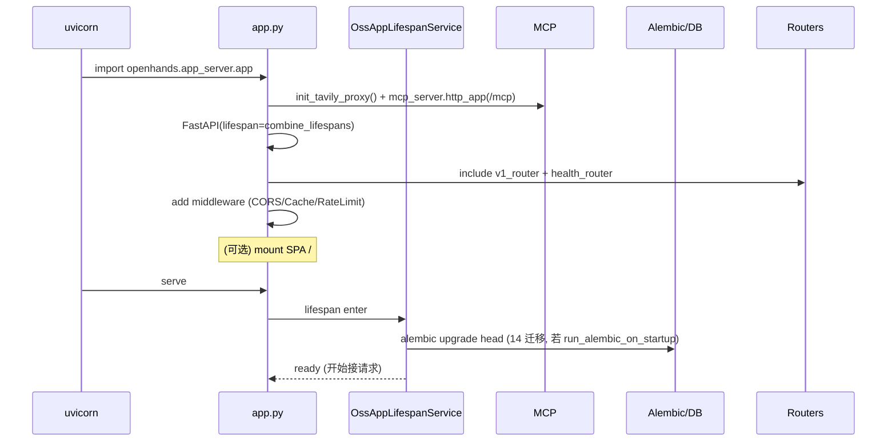
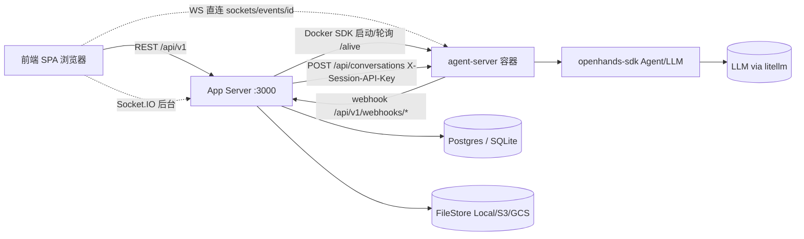
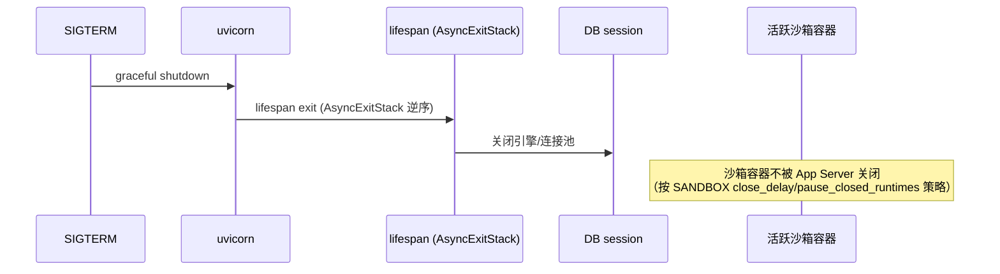

# 运行时架构（运行时架构.md）

## 分析快照

- 分支：`main`；HEAD：`2b31eb84eef6de2048c41d28033d9c3dc7444048`
- 工作区状态：clean；子模块：无
- 分析范围：`containers/`、`docker-compose.yml`、`Makefile`、`openhands/app_server/app.py`、`app_lifespan/`、`sandbox/`、`services/db_session_injector.py`、`enterprise/saas_server.py`
- 未覆盖范围：外部 agent-server 容器内部运行时（无法在本仓库验证）

## 证据分类

- Evidence / Inference / Unknown

## 核心结论

> [Evidence] 运行时由**多进程**组成：
> 1. **App Server 进程**（uvicorn，FastAPI，端口 3000）——本仓库；
> 2. **每会话 agent-server 容器**（外部镜像 `ghcr.io/openhands/agent-server:<v>-python`）——由 App Server 经 Docker SDK 启动；
> 3. **前端浏览器进程**（SPA）；
> 4. （SaaS）**CronJob 进程**（`run_maintenance_tasks.py` 等独立进程）。
>
> App Server 不执行 Agent 循环；它编排沙箱、转发消息、接收 webhook 回灌。

> [Evidence] 必须区分四态：编译期（镜像构建）／启动期（lifespan+迁移）／正常运行期（请求+沙箱+WS）／关闭期（lifespan 逆序释放）。

---

## 1. 进程组成

| 进程 | 角色 | 数量 | Evidence |
| -- | -- | -- | -- |
| App Server（uvicorn） | REST API + webhook 接收 + 沙箱编排 | 1（可水平扩展） | `containers/app/Dockerfile:105`、`app.py:54` |
| agent-server 容器 | 运行 Agent 循环（外部） | 每活跃会话 1 个 | `docker_sandbox_service.py:86` |
| 前端 SPA | UI + WS 客户端 | 每用户浏览器 | `entry.client.tsx` |
| CronJob（SaaS） | 维护任务 / 数据同步 | 按需 | `run_maintenance_tasks.py`、`sync/*.py` |
| Postgres / Redis | 持久化 / 限流 | 外部提供 | `db_session_injector.py`、`enterprise/storage/redis.py` |

> [Evidence] 无 Electron 主/渲染进程；无独立 worker 进程池（后台任务用 asyncio.create_task 同进程内执行）。

## 2. 编译期（镜像构建）

[Evidence] `containers/app/Dockerfile`（多阶段）：
1. `node:25.9-trixie-slim` 构建 `frontend/` → `frontend/build/`；
2. `python:3.13.7-slim-trixie` + Poetry 2.3.4 安装后端依赖；
3. 最终 `openhands-app` 镜像；CMD `uvicorn openhands.server.listen:app --host 0.0.0.0 --port 3000`；
4. 仅 COPY `./skills` 与 `./openhands`（不含 runtime/evaluation）。

[Evidence] `enterprise/Dockerfile` 叠加：`FROM ghcr.io/openhands/openhands:<v>`，装 Node24/jq/gettext，poetry export enterprise 依赖（剥离 `openhands-ai` path 依赖）后 pip install；CMD `uvicorn saas_server:app`；注入两个 service-injector env（`OH_LLM_MODEL_KIND`、`OH_APP_CONVERSATION_INFO_KIND`）。

## 3. 启动期结构

### 启动时序图（Mermaid）

> [Evidence] `app.py:30-86`；`oss_app_lifespan_service.py:15-38`；`config.py:174-183`（SaaS 时嗅探返回 `SaasAppLifespanService`）。
> [Evidence] `get_global_config()` 在首个 `depends_*()` 惰性构造（`config.py:423-433`）。

### SaaS 启动额外步骤

[Evidence] `enterprise/saas_server.py:1-242`：
1. 设 `OPENHANDS_CONFIG_CLS=SaaSServerConfig`、`SERVE_FRONTEND=false`；
2. import OSS `app as base_app`；
3. `GET /saas` 哨兵；
4. `base_app.include_router(...)` 逐个挂企业路由（条件挂载按 `_CLIENT_ID` env）；
5. 中间件：ApiKeyAwareCORS、CacheControl、SetAuthCookie、rate_limit_handler；
6. SPA 挂最后作 catch-all；
7. 异常处理（NoCredentials/Expired→401）；
8. `app = base_app`。

## 4. 正常运行期结构

### 运行组件图（Mermaid）

### 关键运行期机制

- **沙箱生命周期**：`DockerSandboxService`（`docker_sandbox_service.py:86`）拉随机宿主端口、等 `/alive`、暴露 `AGENT_SERVER`/`VSCODE`/`WORKER_1`/`WORKER_2` URL、管理 start/pause/resume/delete。
- **会话状态机**（`live_status_app_conversation_service.py:264`）：WAITING_FOR_SANDBOX → PREPARING_REPOSITORY → RUNNING_SETUP_SCRIPT → SETTING_UP_GIT_HOOKS → SETTING_UP_SKILLS → STARTING_CONVERSATION → READY。
- **DB session 生命周期**：`DbSessionInjector.inject`（`db_session_injector.py:298-341`）每请求注入 `AsyncSession`，成功 commit；`db_session_keep_open` 用于会话启动流式与沙箱删除收尾。
- **事件流**：agent-server 经 WS 推前端 + 经 webhook（`POST /api/v1/webhooks/events/{id}`）回灌 app-server 持久化。
- **pending messages**：WS 断开时前端 REST 入队，会话恢复后消费。

## 5. 线程 / 异步任务模型

- 单 uvicorn 进程，async 事件循环（FastAPI + asyncpg + aiohttp）。
- 后台任务：`asyncio.create_task`（如 `_consume_remaining`、webhook callback processor）。
- 无独立线程池/worker 进程（除 SaaS CronJob 独立进程）。

## 6. IPC / RPC / 网络通信

| 通道 | 方向 | 协议 | Evidence |
| -- | -- | -- | -- |
| 浏览器 ↔ App Server | 双向 | REST（同源 cookie） | `open-hands-axios.ts` |
| 浏览器 ↔ agent-server | 双向 | 原生 WS `/sockets/events/<id>` | `websocket-url.ts:78` |
| 浏览器 ↔ App Server（后台） | 双向 | Socket.IO `oh_event` | `conversation-subscriptions-provider.tsx` |
| App Server ↔ agent-server | 双向 | HTTP（POST 启动/消息）+ webhook 回调 | `live_status...:539`、`webhook_router.py` |
| App Server ↔ Docker daemon | 单向 | Docker SDK（socket 挂载） | `docker-compose.yml`、`docker_sandbox_service.py` |
| App Server ↔ DB | 双向 | asyncpg/pg8000 | `db_session_injector.py` |

## 7. 事件系统 / 缓存 / 文件监听 / 插件加载

- 事件系统：agent-server 事件经前端 reducer（`services/actions.ts`、`observations.ts`）分发到 store；后端 webhook 持久化。
- 缓存：前端 TanStack Query；后端无显式缓存（除 in-memory rate limiter）。
- 文件监听：仅开发期（Vite HMR、uvicorn `--reload`）。
- 插件/技能加载：`skill_loader.py`（全局/用户/org/repo markdown 技能）+ agent-server `/api/skills`。

## 8. 外部进程

- agent-server 容器（外部镜像）。
- Postgres / Redis（外部）。
- Keycloak（SaaS，外部）。
- SaaS CronJob 进程（`run_maintenance_tasks.py` 等）。

## 9. 资源清理 / 正常关闭 / 异常关闭 / 崩溃恢复

### 关闭时序图（Mermaid）

> [Evidence] `combine_lifespans`（`app.py:36-45`）用 `AsyncExitStack` 逆序释放；`SaasAppLifespanService` 负责 PostHog 初始化与 DB shutdown（`enterprise/server/app_lifespan/saas_app_lifespan_service.py`）。
> [Inference] 沙箱容器的 pause/close 由 `pause_closed_runtimes`/`close_delay`/`keep_runtime_alive` 等配置控制（`config.template.toml [sandbox]`），而非 App Server 进程退出直接清理——未关沙箱在下次启动仍存在。
> [Unknown] 生产环境沙箱清理的实际策略（依赖外部 SDK/部署配置）。

- 崩溃恢复：前端 `useSandboxRecovery`、WS 重连（`use-websocket.ts`）；后端 `set_stale_task_error`（1h 阈值，`run_maintenance_tasks.py:23`）；迁移 advisory lock 防并发。

## 10. 平台差异

- sandbox 后端：Docker（默认）/ Process（无 Docker，`RUNTIME=local`）/ Remote（Cloud）。
- WSL：`VITE_WATCH_USE_POLLING`。
- Windows：`pythonnet` 仅 `sys_platform=='win32'`（`pyproject.toml`）。

## 11. 运行时故障模式

| 故障 | 行为 | Evidence |
| -- | -- | -- |
| agent-server 镜像版本与 SDK 不一致 | 启动守卫告警/拒绝 | `sandbox_spec_service.py:119-138` |
| DB 不可达 | 启动迁移失败 / 请求 500 | `oss_app_lifespan_service.py` |
| WS 断开 | 前端重连 + REST pending 兜底 | `conversation-websocket-context.tsx:878-923` |
| 沙箱 `/alive` 超时 | `wait_for_sandbox_running` 轮询失败 | `sandbox_service.py:93-140` |
| 后台任务卡死 | 1h 后置 ERROR | `run_maintenance_tasks.py:23` |
| 迁移并发 | advisory_lock 串行化 | `enterprise/migrations/env.py:142` |

---

## 已确认事实

- 多进程：App Server + 每 sandbox agent-server 容器 + 前端 + （SaaS）CronJob。
- 四态分明：编译/启动/运行/关闭。
- App Server 不跑 Agent 循环。
- 沙箱经 Docker SDK 启动、`/alive` 健康检查。

## 合理推断

- 沙箱生命周期独立于 App Server 进程（配置驱动 pause/close）。

## Unknown 与待验证事项

- [Unknown] 外部 agent-server 容器内部运行时（Agent 循环、WS 协议细节）。
- [Unknown] 生产沙箱清理策略。

## 批判性评估

- 前端直连 agent-server WS 使 App Server 对实时事件无完整可见性。
- 沙箱清理依赖外部配置，本仓库不可见全貌。
- DB session keep_open 跨请求是运行期脆弱点。

## 建设性改善建议

- [Recommendation] 明确沙箱清理的运行时责任并加可观测指标。优先级：中。
- [Recommendation] keep_open 场景加超时与连接监控。优先级：中。
- [Recommendation] lifespan SaaS 选择改显式字段而非字符串嗅探。优先级：中。

## 主要证据索引

- `containers/app/Dockerfile`、`enterprise/Dockerfile:50-56`、`docker-compose.yml`
- `openhands/app_server/app.py:30-86`
- `openhands/app_server/app_lifespan/oss_app_lifespan_service.py:12-38`
- `openhands/app_server/config.py:174-183,423-433`
- `openhands/app_server/services/db_session_injector.py:29-341`
- `openhands/app_server/sandbox/docker_sandbox_service.py:86`、`sandbox_service.py:93-140`、`sandbox_spec_service.py:119-138`
- `openhands/app_server/app_conversation/live_status_app_conversation_service.py:264`
- `enterprise/saas_server.py:1-242`、`enterprise/server/app_lifespan/saas_app_lifespan_service.py`
- `enterprise/run_maintenance_tasks.py:23`、`enterprise/migrations/env.py:142`
